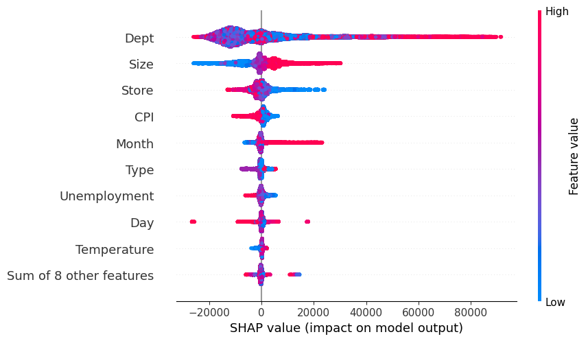

# ML Final Project: Store Sales Forecasting

ჯგუფის წევრები: გიორგი ებანოიძე, ვასიკო ვაზაგაევი, დაჩი სურამელაშვილი

https://www.kaggle.com/competitions/walmart-recruiting-store-sales-forecasting

კონკურში გვევალება ამოვხსნათ Time Series ტიპის ამოცანა. Dataset-ის სახით გადმოგვეცემა თითოეული (Store, Dept) წყვილისათვის Weekly_Sales მიმდევრობა 2010 წლიდან 2011 წლამდე. Weekly_Sales ხასიათდება ყოველწლიური სეზონურობით. ამოცანის მიზანია, რომ გამოვიცნოთ თუ როგორი იქნება Weekly_Sales პარამეტრი შემდეგი 2 წლის განმავლობაში. თითოეულ სტრიქონს dataset-ში დართული აქვს IsHoliday პარამეტრი და ასევე შეგვიძლია გამოვიყენოთ სხვა დამატებითი features `features.csv` და `stores.csv` ფაილებიდან.

კონკურსი ფასდება WMAE მეტრიკით, რაც მსგავსია MAE მეტრიკის, ოღონდ ზოგიერთ მონაცემს, ამ შემთხვევაში `IsHoliday==true` ტიპის მონაცემებს მინიჭებული აქვს წონა 5, დანარჩენებს კი წონა 1.

# Repository-ის სტრუქტურა

* **/plots** - დირექტორია, სადაც თითოეული მოდელისათვის საინტერესო plot-ებია მოთავსებული, რომლებსაც ამ README.md-ში ვიყენებთ
* **model_experiment_XGBoost.ipynb** - XGBoost მოდელის გაწვრთნის პროცესის კოდი თითოეული ნაბიჯით.
* **model_experiment_LightGBM.ipynb** - LightGBM მოდელის training.
* **model_inference_LightGBM.ipynb** - მოდელი LightGBM-ის inference ფაილი.
* **model_experiment_DLinear.ipynb** - DLinear training.
* **model_experiment_prophet.ipynb** - Prophet training.
* **model_inference_patchtst.ipynb** - PatchTST training.
* **model_inference_patchtst.ipynb** - PatchTST inference.
* **model_experiment_TemporalFusionTransformer.ipynb** - TFT training.
* **model_n_beats.ipynb** - N-Beats Training.
* **model_sarima.ipynb** - Sarima Training.

# Training

ამოცანის ამოსახსნელად გამოვცადეთ რამდენიმე სხვადასხვა მოდელი. თითოეულს გასაწვრთნელად სჭირდება განსხვავებული ტიპის მიდგომა როგორც Feature Selection, Feature Engineering დროს, ასევე თვითონ training პროცესში. შესაბამისად თითოეულ მოდელს განვიხილავთ ცალკე.

ზოგი მოდელის ექსპერიმენტები დალოგილია MLFlow-ზე Dagshub-ის საშუალებით, ზოგი კი Wandb-ზე.

## XGBoost

https://dagshub.com/Cimbir/Store-Sales-Forecasting.mlflow/#/experiments/4

ნოუთბუქი: `model_experiment_XGBoost.ipynb`

ამ მოდელის გაწვრთნისას ვცდიდი თუ რამდენად კარგად იმუშავებდა სხვადასხვა features და შესაბამისად მჭირდებოდა სხვადასხვა ექსპერიმენტისათვის განსხვავებული Preprocessor-ები, რომლებიც პირდაპირაა MLflow-ზე დალოგილი `XGBoost_Preprocessor` პრეფიქსით.

ამ ექსპერიმენტებში გამოვიყენე ის ფაქტი, რომ XGBoost-ს თავად შეუძლია რელევანტური feature-ების შერჩევა XGBoost ხეების ასაგებად და ყველა მონაცემთა ბაზა `stores.csv`, `features.csv` და `train.csv` დავმერჯე ერთმანეთზე.

Train/Validation მონაცემების გამოსაყოფად გამოვიყენე `SPLIT_DATE=2011-09-01` თარიღი და გაჭრილი მონაცემებით ავაგე გრაფიკი, რომელიც ნოუთბუქშია ნაჩვენები.

### XGBoost Feature Engineering 1

ექსპერიმენტები დავიწყე ძალიან მარტივი feature-ების შექმნით: `Year`, `Month`, `Day`. ფაქტობრივად 1 სტრინგად ჩაწერილი `Date` feature დავშალე 3 რიცხვით feature-ად. იმედი მქონდა, რომ ეს feature-ები დაეხმარებოდა მოდელს პერიოდულობის აღმოჩენაში. ასევე იმედს ვიქონიებდი, რომ (Store, Dept) წყვილით შეძლებდა განესხვავებინა სხვადასხვა Time Series და თითოეულისათვის გაეკეთებინა სწორი prediction.

XGBoost-ს საშუალება მივეცი თავად გამკლავებოდა categorical features, როგორიცაა `Type` და `na` მნიშვნელობები ჩემი მიერ დაწერილი preprocessing step-ის გარეშე.

გამოვიყენე low-level XGBoost API გაწვრთნის პროცესისთვის და არა scikit API, რომელიც ბევრის საშუალებას არ მაძლევდა. მაგალითად მჭირდებოდა რაიმე გზა, რომ XGBoost-ს პრიორიტეტი მიენიჭებინა IsHoliday==true მონაცემებისათვის. DMatrix საშუალებას მაძლევდა, რომ დამესეტა weight-ები თითოეული მონაცემისათვის

გამოვიყენე low-level XGBoost API გაწვრთნის პროცესისთვის და არა scikit API, რომელიც ბევრის საშუალებას არ მაძლევდა. მაგალითად მჭირდებოდა რაიმე გზა, რომ XGBoost-ს პრიორიტეტი მიენიჭებინა `IsHoliday==true` მონაცემებისათვის. `DMatrix` საშუალებას მაძლევდა, რომ დამესეტა `weight`-ები თითოეული მონაცემისათვის, რომლებიც გათვალისწინებული იქნებოდა Loss ფუნქციის მნიშვნელობაში.

### XGBoost Training 1

თავდაპირველი მნიშვნელოვანი ნაბიჯი იყო, რომ მეპოვა ამ ამოცანისათვის ყველაზე კარგი Loss Objective. თავდაპირველი ლოგიკური არჩევანი ვიფიქრე, რომ იქნებოდა MAE მეტრიკის გამოყენება Objective-ად, რომელიც დაიმპლემენტირებულია XGBoost-ის ახალ ვერსიაში `AbsoluteError`-ის სახელით. თუმცა გასათვალისწინებელია, რომ XGBoost-ს სჭირდება დაითვალოს პირველი რიგის წარმოებული და მეორე რიგის წარმოებული training-ის დროს, `AbsoluteError` კი 1 წერტილში საერთოდ არაა გაწარმოებადი და მეორე რიგის გრადიენტი კი 0-ის ტოლია. შესაბამისად შეიძლება, რომ საუკეთესო შედეგი არ დაედო `AbsoluteError`-ის გამოყენებას, ამიტომაც გადავწყვიტე ჩამეტარებინა ექსპერიმენტები.

### XGBoost_Obj_SquaredError_Estimator_1 - 200

https://dagshub.com/Cimbir/Store-Sales-Forecasting.mlflow/#/experiments/4/runs/d29087623d09491db75fdcc53adf4d80

ამ ექსპერიმენტების სერიაში `Estimator_1`-დან დაწყებული `Estimator_200`-ით დამთავრებული ვეძებდი რეკომენდირებული loss ფუნქცია `SquaredError`-ის baseline პერფორმანს, რათა შემდგომში შემედარებინა სხვა loss ფუნქციებისთვის.

თუ Estimator-ს ავიღებდი 1-ს, გასაკვირი არ არის, რომ მოდელი არ იყო საკმარისად კომპლექსური ამოცანისთვის და ვიღებდი მაღალი bias-ის მქონე underfitted მოდელს:

```
wmae_train 12099.414434121085
wmae_test 12441.135631336625
```

უკვე 10 Estimator-ზე ჩამოდიოდა ცდომლიება 6000-ის ფარგლებში, 50-ზე 3000-ის ფარგლებში, 100-200 Estimator-ზე კი უკვე რეგულარიზაციის გარეშე overfitted ხდებოდა მოდელი, როდესაც train 2000-ის ფარგლებში იყო, ხოლო test ისევ 3000-ის:

```
mae_train 2333.30269210183
mae_test 3369.795934797164
wmae_train 2350.272432798231
wmae_test 3505.5818113659448
```

### XGBoost_Obj_AbsoluteError_Estimator_1 - 200_HigherLR

https://dagshub.com/Cimbir/Store-Sales-Forecasting.mlflow/#/experiments/4/runs/c7f9a37a6b5c49b291cf8453f15cf288

`AbsoluteError` თავდაპირველად `Estimator=1`-ზე უკეთესი შედეგი დადო:

```
mae_train 11075.31378309588
mae_test 11305.03717124261
wmae_train 11248.186628292535
wmae_test 11582.631160385079
```

თუმცა რაც უფრო ვამატებდი `Estimator`-ებს, აშკარა ხდებოდა, რომ უფრო უჭირდა მონაცემებზე მორგება და overfit-იც კი ვიდრე `SquaredError` loss ფუნქციას.

`Estimator=100`-ზე მივიღე შემდეგი შედეგი:

```
wmae_train 3393.5045087223466
wmae_test 4106.367590955688
```


ეს შევადაროთ `SquaredError`-ს `Estimator=100`-ზე:

```
wmae_train 2887.015479419683
wmae_test 3707.861059151612
```


გრაფიკებიდანაც ჩანს, რომ `SquaredError` გაცილებით უკეთ აკეთებს prediction-ებს validation set-ზე, მიუხედავად იმისა, რომ ტოლი რაოდენობის XGBoost ხეები გვაქვს ორივე მოდელში.


შთაბეჭდილება დამრჩა, რომ იქიდან გამომდინარე, რომ მეორე რიგის გრადიენტი 0-ის ტოლი იყო უფრო ნელა სწავლობდა მოდელი, ამიტომაც learning rate-ის გაზრდა ვცადე `eta=0.2` პარამეტრით.

ამ ცდელობას გაცილებით უკეთესი შედეგი არ გამოუღია:

```
wmae_train 3649.768545723227
wmae_test 4218.194824268481
```

### XGBoost_Obj_HuberError_Estimator_100 - SlopeSearch

https://dagshub.com/Cimbir/Store-Sales-Forecasting.mlflow/#/experiments/4/runs/884d1229000847a6a51175318fbf76d6

ასევე ვცადე HuberLoss-ის გამოყენება, რომელიც ფაქტობრივად აერთიანებს MSE და MAE loss ფუნქციებს და delta პარამეტრი გადაწყვეტს, რომელი გამოიყენოს კონკრეტული მნიშვნელობებისათვის.

იდეაში ამ loss-ის გამოყენება კარგად ჟღერდა, თუმცა პრაქტიკაში MAE-ზეც და MSE-ზეც უფრო უარესი შედეგი აჩვენა.

GridSearch გავუშვი `huber_slope`-ზე იგივე `delta` პარამეტრზე მნიშვნელობებით `[0.7, 1.5, 2.5, 5, 10, 100, 1000]`. საუკეთესო ვარიანტად შეარჩია `huber_slope=10` შემდეგ ექსპერიმენტში:

https://dagshub.com/Cimbir/Store-Sales-Forecasting.mlflow/#/experiments/4/runs/1d66d95e0a424555a36e965f9578523d

თუმცა შედეგები მაინც არ იყო კარგი:

```
mae_train 4590.3573569983255
mae_test 5370.413544734716
wmae_train 4752.668478419167
wmae_test 5623.664094910361
```

ამ ექსპერიმენტებიდან საბოლოო ჯამში მივედი იმ დასკვნამდე, რომ XGBoost ყველაზე კარგად მუშაობს `SquaredError`-ის მინიმიზაციისას, თუნდაც WMAE მეტრიკა მაინტერესებდეს ყველაზე მეტად, ამიტომაც ამიერიდან ამ loss ფუნქციას გამოვიყენებ. თუ პრობლემა შეიქმნება WMAE-ს მინიმიზაციისას შემიძლია early stopping მექანიზმი ჩავურთო ყოველთვის.

### XGBoost_Estimator_200_L1_100_L2_100_Depth_3

https://dagshub.com/Cimbir/Store-Sales-Forecasting.mlflow/#/experiments/4/runs/33586c9faf314360b3189cae1fbdeab6

შემდეგი ნაბიჯია, რომ ავიღო overfitted მოდელები, რაც მივიღე და შევეცადო გავასწორო მათი მაღალი ვარიაცია regularization მეთოდების დამატებით. სასურველია, რომ train და validation score-ები დაახლოებით თანაბარი იყოს.

ვთქვათ ავიღოთ მოდელი `XGBoost_Obj_SquaredError_Estimator_100`

```
wmae_train 2887.015479419683
wmae_test 3707.861059151612
```


თუ დავაკვირდებით კონკრეტულად (Sale, Dept)=(1, 2) წყვილისთვის Weekly_Sales-ის prediction-ს, ვხედავთ, რომ ფაქტობრივად დაიზეპირა მოდელმა training set-ში არსებული pattern. უმჯობესი იქნება ამ შემთხვევაში, რომ უფრო ფრთხილი გზა ავარჩევინოთ XGBoost ხეების მაქსიმალური ზომის შემცირებით, L1 ან L2 რეგულარიზაციის დამატებით.

გადავწყვიტე საუკეთესო ჰიპერ-პარამეტრები მეპოვა GridSearch-ის საშუალებით შემდეგ range-ში:

```
max_depth in [3, 5]
alpha in [0, 3, 30, 100]
lambda in [1, 10, 20, 40, 100, 200]
```

მოცემული პარამეტრების ყველა შესაძლო ტრიპლეტისათვის გავწვრთენი მოდელი `Estimator=200`-ზე.

საუკეთესო მოდელი ამოვარჩიე მინიმალური სხვაობით WMAE_TRAIN-სა და WMAE_TEST-ს შორის შემდეგი პარამეტრებით:

```
{
    'objective': 'reg:squarederror', 
    'alpha': 100, 
    'lambda': 100, 
    'max_depth': 3
}
```

შეგვიძლია დავაკვირდეთ იმავე გრაფიკს (1, 2) მაღაზიისათვის და დავინახავთ, რომ ზემო გრაფიკთან შედარებით გაცილებით უფრო ნაკლებად მოძრაობს prediction მრუდი.


თუმცა ასევე გასათვალისწინებელია, რომ train და validation შედეგები ორივე გაუარესდა, მიუხედავად იმისა, რომ Estimator-ების რაოდენობა 100-დან 200-მდე გავზარდე.

```
mae_train 4842.940823694781
mae_test 5193.878655162364
wmae_train 5017.586377879966
wmae_test 5479.755364557295
```

### XGBoost_Estimator_500_L1_100_L2_100_Depth_3

https://dagshub.com/Cimbir/Store-Sales-Forecasting.mlflow/#/experiments/4/runs/80cfc38226a843f397b4f02eab48d648

ამ ექსპერიმენტში იმავე მოდელს ვიყენებ, რაც წინა ექსპერიმენტში თუმცა Estimator-ების რაოდენობას 500-მდე ვზრდი.

log-ებიდანაც ჩანს, რომ training-ის დროს test score ბოლოსკენ თითქმის აღარ იცვლება, თუმცა train score მაინც მცირდება

```
[495]	train-mae:4467.05844	train-wmae:4467.05811	test-mae:5067.59927	test-wmae:5067.59912
[496]	train-mae:4466.43190	train-wmae:4466.43164	test-mae:5066.75204	test-wmae:5066.75098
[497]	train-mae:4465.79447	train-wmae:4465.79443	test-mae:5066.39085	test-wmae:5066.39062
[498]	train-mae:4465.74906	train-wmae:4465.74951	test-mae:5068.73426	test-wmae:5068.73438
[499]	train-mae:4464.18536	train-wmae:4464.18555	test-mae:5068.05948	test-wmae:5068.05957
```

აქედან მივდივარ დასკვნამდე, რომ ჩემ მიერ შერჩეული feature-ების ლიმიტამდე მივედი ფაქტობრივად და გაუმჯობესება რთული იქნება overfit-ის გარეშე.

ამ მოდელისათვის შემდეგნაირად გამოიყურება feature importance ჰისტოგრამა:


ჩემ მიერ შედგენილი feature-ებიდან, როგორც ჩანს, ყველაზე დიდი ყურადღება ექცევა Month-ს შემდეგ Day-ს და ბოლოს Year-ს.

მოდელს მიაჩნია, რომ Size ყველაზე მნიშვნელოვანი feature არის. დიდი ალბათობით იმიტომ, რომ შემოსავალი მჭიდროდაა კორელაციაში Size-ის მნიშვნელობასთან.




ჩემს ჰიპოთეზას Size-ის შესახებ SHAP-ის Beeswarm plot-იც ადასტურებს. აქ ვხედავთ, რომ როდესაც Size-ის მნიშვნელობა მაღალია(წითლად რა ნაწილიცაა მონიშნული), ეს ეუბნება მოდელს, რომ Weekly შემოსავალიც მაღალი იქნება.

### XGBoost Feature Engineering 2

შემდეგი ნაბიჯია, რომ უკეთესი და უფრო კომპლექსური feature-ები შევარჩიო. ვიფიქრე, რომ Lag feature-ები დამემატებინა, რომლებიც მოდელს ეუბნებიან თუ რამდენიმე კვირის წინ რა იყო Weekly_Sales-ის მნიშვნელობა. ლოგიკურია, რომ მოდელისათვის ყველაზე კარგი იქნებოდა, რომ იცოდეს, მაგალითად, ბოლო 5 კვირის Weekly_Sales და ამით შეძლოს Prediction-ის გაკეთება. თუმცა ამის იმპლემენტაციას მივყავართ XGBoost-ის ლიმიტაციებამდე. მოდელი ძლიერად დამოკიდებული გახდებოდა წინა კვირების Sales feature-ებზე, თუმცა Inference-ის დროს არ იცი 2 წლიან range-ში არც ერთი მონაცემის Weekly_Sales. ვიფიქრე, რომ შესაძლებელი იყო დამეიმპლემენტირებინა Recursive Forecasting-ი, რომლის დროსაც ჯერ 1 მონაცემზე გააკეთებს prediction-ს, შეინახავს ამ prediction-ს და შემდეგი prediction-ისათვის გამოიყენებს ამ მნიშვნელობას. ანუ ყოველი მომდევნო prediction დამოკიდებული იქნებოდა წინა 5 prediction-ის მნიშვნელობაზე მაგალითად. ეს მიდგომა დავაიმპლემენტირე `CustomXGB` კლასში, მაგრამ პრაქტიკულად prediction step ძალიან ნელი გამოდგა და დაახლოებით ნახევარი საათი უნდოდა validation set-ზე გატარებას. ამ მიდგომით ყველანაირ ოპტიმიზაციას ვაბათილებდი, რასაც XGBoost მთავაზობს და საბოლოოდ გადავწყვიტე, რომ არ ღირდა ამ გზის არჩევა.

ალტერნატივა იქნებოდა, რომ lag-ები ამეღო წინა წლიდან, რადგან წლიური სეზონურობით გამოირჩევა მონაცემები. ეს იმ პრობლემას შექმნიდა, რომ მაქსიმუმ 1 წლით შეეძლებოდა მომავალში prediction და თუ რაიმე მიზეზის გამო ეს ახალი feature-ები NA იყო, შეიძლება performance მკვეთრად გაუარესებულიყო, თუმცა მაინც გადავწყვიტე ეს მიდგომა ამერჩია.

### XGBoost_LagFeats_Obj_SquaredError_Estimator_300_LR_0.1

https://dagshub.com/Cimbir/Store-Sales-Forecasting.mlflow/#/experiments/4/runs/f4777f720437444a90694bee891bd1cb

ამ მოდელში დავამატე შემდეგი lag-ები: 
`lags=[7*51, 7*52, 7*53]`

```
mae_train 2728.242011486581
mae_test 2807.606352043303
wmae_train 2824.445070695149
wmae_test 2985.1010091897083
```
ეს მიდგომა საკმაოდ წარმატებული გამოდგა ერთი შეხედვით. მაგალითად (1, 1) მაღაზიისათვის შეუძლია, რომ თითქმის უნაკლოდ გამოიცნოს validation set-ში რა მოხდება.


 ისიც აღსანიშნავია, რომ train და test ქულები ძალიან ახლოსაა. `AddLags()` კლასში მხოლოდ training set-ზე ხდება fit(), სადაც მოდელი იმახსოვრებს თითოეული თარიღისათვის მნიშვნელობებს და test set-ზე transform()-ს როდესაც ვაკეთებ, მასში ახალი lag feature-ები მხოლოდ ემატება training set-დან. იმაზე ვიზრუნე რომ validation set-დან არ გადმოჟონოს არაფერმა training-ში.


პრობლემა მაშინ ჩანს, როდესაც ძალიან შორს მივდივართ training set-დან და ამ დროს მოდელმა აღარ იცის რა გააკეთოს. prediciton მკვეთრად უარესდება, როგორც გრაფიკზე ჩანს.


აქედან გამომდინარე Inference-ზე გაშვებამდე საუკეთესო მოდელი ჯობია მთლიან dataset-ზე გავწვრთნა.

Feature Importance-ის მხრივ, ჩემი დამატებული feature-ები ერთ-ერთი ყველაზე მნიშვნელოვანი გახდა წინა მოდელებთან შედარებით, რაც მოსალოდნელი იყო.


## LightGBM

https://dagshub.com/Cimbir/Store-Sales-Forecasting.mlflow/#/experiments/10

გადავწყვიტე იმავე მიდგომები გამომეცადა ასევე LightGBM-ზე და შემედარებინა XGBoost-თან performance-სა და სიჩქარეში.

### LightGBM Feature Engineering 1

თავდაპირველი ექსპერიმენტებისათვის XGBoost-ის მსგავსად აქაც მხოლოდ დავამატე `Year`, `Month`, `Day` და Train/Validation Split გავაკეთე ისევ `2011-09-01`-ში. იმისათვის, რომ მოდელმა დაითვალოს WMAE loss ფუნქცია, LightGBM-ის საკუთარ lgb.Dataset ობიექტში უნდა დამესეტა weight პარამეტრები თითოეული row-სთვის და შემდეგ ამერჩია MAE loss function. ასევე დავწერე custom WMAE მეტრიკა, რომელიც მოდელის training-ის შემდეგ გაეშევება და predict()-ს გამოიყენებს. ეს მარტივი Preprocessor MLflow-ზე დავლოგე, როგორც `LightGBM_Preprocessor_1`

### LightGBM Training 1

თავდაპირველად გადავწყვიტე ისევ SquaredError vs AbsoluteError გამომეცადა LightGBM-ისათვის და შემემოწმებინა ორივე Loss ფუნქციისათვის, როგორ გავლენას ახდენს Learning Rate-ის ცვლილება.


### LightGBM_Objective_MAE_Booster_1 - 500

https://dagshub.com/Cimbir/Store-Sales-Forecasting.mlflow/#/experiments/10/runs/f155f126733e4bc487ee34565e16ec44

ამ ექსპერიმენტების სერიაში default პარამეტრებზე და MAE loss ფუნქციაზე ვცადე, რომ შემეცვლა `num_booster_round` 1-დან 500-ის ჩათვლით და დავკვირვებოდი, როდის მიიღება overfit მოდელი.

Booster-ების რაოდენობის 1-დან 50-მდე გაზრდით მკვეთრად უმჯობესდება wmae_test დაახლოებით 1200-დან 5000-ის ფარგლებში. ანუ შეგვიძლია დავასკვნათ, რომ `num_booster_round<50` გვაძლევს underfitted მოდელს. 100-დან დაწყებული უკვე შესამჩნევი ხდება დიდი აცდენა train და test ქულებს შორის, თუმცა აღსანიშნავია, რომ LightGBM-ის overfit უფრო რთულია ვიდრე XGBoost-ის.

მაგალითად, რომ ავიღოთ უკიდურესი შემთხვევა `num_booster_round=500`, სადაც უკვე დაახლოებით 800 არის აცდენა train და test loss-ებს შორის:

```
wmae_train 3028.7613881699067
wmae_test 3842.1951623332334
```

ისევ მაღაზია (1, 1)-ის prediction vs observation plot-ს რომ დავაკვირდეთ, დავინახავთ, რომ როდესაც XGBoost გაცილებით უფრო flexibility-ის იჩენდა და პირდაპირ ერგებოდა training-ს, მაგალითად peak მნიშვნელობებს ყოველთვის აღწევდა, LightGBM გაცილებით უფრო თავშეკავებულია.


პრობლემა იკვეთება, როდესაც შევხედავთ ნაკლებ შემოსავლიან მაღაზიებს, მაგალითად (30, 52), რომლის შემოსავალიც [0, 100] ფარგლებში მერყეობს.


მოდელი ამ დროს საკმაოდ არარეალისტური Sales-ის prediction-ს აკეთებს train set-ზეც კი. ჩემი აზრით, ეს იმიტომ ხდება, რომ იმდენად მცირეა მსგავსი დაბალშემოსავლიანი მაღაზიების რაოდენობა training set-ში, რომ მოდელი არაა encouraged საერთოდ დაისწავლოს ასეთი შემთხვევები. დიდი ალბათობით ამ პრობლემას გამოასწორებს Lag-ების დამატება მოდელისათვის და საშუალება ექნება შეხედოს წინა წლის მონაცემებს, ასევე შესაძლებელია, რომ თითოეული store-ისათვის დავითვალოთ საშუალო და მედიანა training მონაცემებიდან და ეგ დავუსეტოთ ახალ feature-ად.

### LightGBM_Objective_MAE_Booster_200_LR_0.05 - 0.01

ამ ექსპერიმენტებით აღმოვაჩინე, რომ learning rate-ის ცვლილება მკვეთრ გავლენას ახდენს საბოლოო შედეგზე. თუ შევამჩნევ, რომ მოდელი overfit-ს იწყებს მოცემული booster-ების რაოდენობით ყოველთვის შესაძლებელი იქნება, რომ learning rate default-თან შედარებით უფრო შევამცირო.

დაბალი learning_rate უფრო სტაბილურობას მიანიჭებს მოდელს, თუმცა ძალიან დაბალი learning_rate, მაგალითად 0.01 ჩვენი მოდელის შემთხვევაში პირიქით ხელს უშლის გაწვრთნის პროცესს:

```
mae_train 7232.159794621987
mae_test 7498.885142485389
wmae_train 7411.134066414457
wmae_test 7770.059105122366
```

Plot-ს თუ დავაკვირდებით, დავინახავთ, რომ lr=0.01-ზე და 200 booster-ზე ფაქტობრივად არაფერი არ დაისწავლა მოდელმა და prediction უბრალოდ სწორი ხაზია.


### LightGBM_Objective_Regression_Booster_1 - 200

https://dagshub.com/Cimbir/Store-Sales-Forecasting.mlflow/#/experiments/10/runs/27ef6d2c6b624ffdbc6a643e6f9ca043

ახლა რაც შეეხება შემთხვევას, როდესაც Loss ფუნქციად ავიღებთ SquaredError-ს, რომელსაც `regression` ჰქვია LightGBM-ში. XGBoost-ში უფრო კარგი შედეგები აჩვენა ამ loss ფუნქციამ და ამ შემთხვევაშიც საინტერესო იქნება.

ამ შემთხვევაშიც num_boost_round<50 მოდელები არის underfitted და მაღალი bias-ის მქონე. 1 booster-დან 50-მდე ჩამოსვლით test ქულა უმჯობესდება 14,000-დან დაახლოებით 5000-მდე მკვეთრად. 100 booster-დან დაწყებული 200-მდე მკვეთრი აცდენა იწყება train, test loss-ებს შორის. მაგალითად 200 booster-ზე გვაქვს:

```
mae_train 3263.835187022739
mae_test 3988.0463961320997
wmae_train 3285.4044149093324
wmae_test 4181.272388146837
```

და ეს შედეგი მოდი შევადაროთ MAE objective-ს ასევე 200 booster-ზე სხვა ყველა იმავე პარამეტრით:

```
mae_train 3642.6521061449553
mae_test 4217.9405385977925
wmae_train 3815.210534380747
wmae_test 4462.752770172549
```

ერთ-ერთი მნიშვნელოვანი განსხვავება MAE-სთან შედარებით ისაა, რომ SquaredError loss ცდილობს არსად არ ჰქონდეს დიდი ცდომილებები და ფასის spike-ებთან ახლოს უფრო ახლოს მიდის(შეგვიძლია შევადაროთ ზემოთ MAE-ს გრაფიკს იმავე მაღაზიისათვის).


ერთი შეხედვით XGBoost-ის მსგავსად უფლო მალე მიიღება test/validation set-ზე უკეთესი შედეგები SquaredError loss-ით. დიდი ალბათობით, როგორც უკვე ვთქვი, უკეთესი გრადიენტის გამო ხდება ეს, თუმცა LightGBM-ში გადავწყვიტე, რომ გამოვიყენო მაინც MAE loss ფუნქცია. იმედი არის, რომ რადგან დიდი სხვაობების კვადრატებს არ მიაქცევს ყურადღებას და მხოლოდ სხვაობის მოდულს დააკვირდება, საბოლოოდ უფრო კარგი შედეგი ექნება WMAE-ზე.

### LightGBM Feature Engineering 2

შემდეგ ნაბიჯად გადავწყვიტე, რომ დამემატებინა Group Features. თითოეული (Store, Dept)-ისათვის დამეთვალა Min, Max, Mean, Median და ესენი ჩამეწერა ახალ feature-ებად. ამ სვლის მთავარი იდეა ის იყო, რომ მოდელს შეეძლებოდა გაანალიზოს თუ დაახლოებით რას უნდა ელოდოს თითოეული მაღაზიიდან და ძალიან უხეშ შეცდომებს აღარ დაუშვებდა. მაგალითად მაღაზიას რომლის შემოსავალი არასდროს აცდენია 1000-ს, უცნაური იქნება, რომ უცებ დიდი თანხა მიიღოს. ვიმედოვნებ, რომ prediction-ებს ჩასვამს [min, max] შუალედში და შეინარჩუნებს mean-სა და median-ს, შესაბამისად overfit-საც უპირისპირდება ფაქტობრივად ეს მიდგომა და უზრუნველყოფს, რომ ლოგიკურ ჩარჩოში იქნება prediction-ები.

სანამ ამ Feature-ებს დავაიმპლემენტირებდი ეს იყო Feature Importance Plot 200 Booster-იანი MAE objective მოდელისათვის:


### LightGBM_GroupFeats_Objective_MAE_Booster_100

https://dagshub.com/Cimbir/Store-Sales-Forecasting.mlflow/#/experiments/10/runs/f39f49481a7443778385cff6c90d8fb6

Group Feature-ების იმპლემენტაციამ 100 Booster-იან მოდელზეც კი ძალიან კარგი შედეგი მომცა:

```
mae_train 2084.999485440237
mae_test 2504.721237950218
wmae_train 2260.9735262356508
wmae_test 2763.8684216768806
```


ახლა მოდელი ამჯობინებს, რომ რისკიანი prediction-ები არ გააკეთოს და მოცემული მონაცემების ფარგლებში დარჩეს, ზუსტად ისე, როგორც ვიმედოვნებდი რომ მოხდებოდა.


ამ მიდგომამ გამოასწორა პრობლემა მაღაზია (30, 52)-ისთვისაც(რომელიც ზემოთ იყო მოყვანილი), რომლისთვისაც მოდელი training set-ზეც კი ძალიან დიდ და არალოგიკურ prediction-ებს აკეთებდა.

ახლა მიუხედავად იმისა, რომ არ ცდილობს მოდელი მკვეთრი ცვლილებები დაიჭიროს, ვფიქრობ, უფრო კარგი შედეგია წინასთან შედარებით და თან overfit-ის საფრთხეც ნაკლებია.


შეგვიძლია ჩავხედოთ Feature Importance ჰისტოგრამასაც და დავრწმუნდეთ, რომ მართლა ჩემი შემოღებული feature-ები იქცა ყველაზე მნიშვნელოვნად.


როგორც ვვარაუდობდი Mean-სა და Median-ს დიდი მნიშვნელობა ენიჭება, ასევე ყურადღებას აქცევს Min-სა და Max-ს რაც ძალიან კარგია.

### LightGBM_GroupFeats_Objective_MAE_Booster_200_LR_0.03

https://dagshub.com/Cimbir/Store-Sales-Forecasting.mlflow/#/experiments/10/runs/b6a958bb95be4076b8a0fed89d737405

Overfit-ის შესამცირებლად თავდაპირველი ნაბიჯი რაც გადავდგი ისაა, რომ learning_rate=0.03-ზე დავიყვანე და Booster-ების რაოდენობა გავზარდე 200-მდე. შედეგად უფრო სტაბილური მოდელი მივიღე:

```
mae_train 2202.967977512935
mae_test 2605.143088553982
wmae_train 2420.5725538976876
wmae_test 2888.417111338083
```

### LightGBM Feature Engineering 3

საბოლოოდ საუკეთესო მოდელის მისაღებად, როგორც XGBoost-ში აქაც გადავწყვიტე Lag Feature-ების შემოღება. `[7*51, 7*52, 7*53]` დღის წინანდელ Weekly_Sales ჩაუსვამს ახალ Feature-ებად.

### LightGBM_GroupLagFeats_Objective_MAE_Booster_100

https://dagshub.com/Cimbir/Store-Sales-Forecasting.mlflow/#/experiments/10/runs/43a826d6d18e473fb689a3cee2d7ad3d

100 Booster-იანმა მოდელმა ამ feature-ებით მომცა შემდეგი შედეგები:

```
mae_train 2051.544241439307
mae_test 2269.138472935298
wmae_train 2248.8774571895674
wmae_test 2535.1518000122655
```
ახლა შეუძლია წინა წლის მონაცემები აიღოს და უკეთესად შეუძლია გამოიცნოს საით წავა მომავალი Weekly_Sales.


ასევე შეგვიძლია შევხედოთ ყველა (Store, Dept) წყვილის საშუალო Weekly_Sales ერთ გრაფიკში:


აშკარაა, რომ ბოლო მონაცემებზე Lag-ის მნიშვნელობები გამოილევა, რადგან წინა წლიდან აღარ გვაქვს ინფორმაცია, თუმცა როგორც ხედავთ, ძალიან მაინც არ ასცდება ნამდვილ მნიშვნელობებს, რადგან Min, Max, Mean, Median დაიჭერს.

შეგვიძლია ასევე შევხედოთ feature importance-ს და ვნახავთ, რომ ამ feature-ებს უფრო მეტი მნიშვნელობა ენიჭებათ, ვიდრე Lag-ებს, თუმცა Lag-ებსაც შეაქვთ მნიშვნელოვანი წვლილი საბოლოო prediction-ში. მთავარია, რომ მოდელი არ იყოს მხოლოდ ამათზე დამოკიდებული.


თუ გვაინტერესებს კონკრეტულად რას აკეთებენ ჩემ მიერ დამატებული feature-ები შეგვიძლია SHAP Beeswarm Plot გამოვიყენოთ.


აქ მაგალითად ჩანს, რომ Mean და Median-ის მაღალი მნიშვნელობები ფასს მაღლა ექაჩება, რაც ლოგიკურია. ასევე 364 დღის წინ Sales თუ მაღალი იყო ესეც ზემოთ ასწევს model-ის output-ს, თუმცა იმდენად არა, როგორც სხვა feature-ები.

ერთი შეხედვით ამ მოდელმა ძალიან კარგი შედეგები დადო, თუმცა გასათვალისწინებელია, რომ inference-ის დროს test set-თან შედარებით ჩვენი validation set გაცილებით უფრო პატარაა, inference კი მოგვიწევს 2 წლიან შუალედზე. ამიტომაც ძალიან მნიშვნელოვანი იქნება, რომ მთლიანი dataset დავფიტოთ სანამ inference-ს გადავწყვეტთ.

## SARIMA

ერთ-ერთი პირველი მოდელია რომელიც გავტესტეთ. ARIMA-სგან ის განასხვავებს, რომ SARIMA-ში შემოდი სეზონურობის განმარტება, რაც ამ time series პრობლემისთვის არის შესაბამისი, რადგან დატაში აღინიშნებოდა პიკები 1 წლის დაშორებებით. ამასთან ერთად, ამ მოდელისთვის დამახასიათებელია ის, რომ გადაცემული დატა უნდა იყოს stationary, რაც იმას ნიშნავს, რომ არ უნდა შეიცვალოს მისი mean და variance დროთა განმავლობაში, ანუ ფაქტობრივად thrend უნდა გავუქროთ. ამისი მოხერხება შესაძლებელია მარტივად datapoint-ებს შორის სხვაობების გაგებით.

### ACF/PACF

იმის დასადგენად რომ სეზონურობა მართლაც 52 (52 კვირა = 1 წელი) უნდა ყოფილიყო, ამავდროულად გამოვიყენეთ ACF და PACF გრაფიკები, რომლებიც გვიჩვენებს თუ რამდენად კორელირებული იყო წინა კვირების მონაცემები მიმდინარე კვირასთან. მკვეთრად დიდი მნიშვნელობები მიანიშნებს იმას, რომ SARIMA-ს მოდელში S სეზონურობის ცვლადი დიდი ალბათობით ეგ უნდა იყოს. შესაბამისად, ეგ მნიშვნელობა ავირჩიეთ. ამ გრაფიკების აგებას სჭირდება რომ დატა ასევე stationary იყოს.


### Preprocessing

SARIMA-ს მოდელს ხშირ შემთხვევაში არ სჭირდება სხვა ცვლადები forecast-ის გასაკეთებლად და ხშირად კიდევაც დიდად არაფრით ეხმარება, თუმცა ტრენინგის მიზნისთვის მაინც დავამატე დამატებითი ცვლადების დამუშავების შესაძლებლობაც. დატას მოსამზადებლად შემდეგი preprocessing გავაკეთე:

* Cleaning - NaN ცვლადები შევავსე საშუალოებით. ესენი იყვნენ Markdown ცვლადები, რომელთა საშუალოებით შევსება ლოგიკური გამოსავალი იყო
* Encoding - Type და IsHoliday ცვლადები მარტივად შესაბამის რიცხვებად გარდავქმენი

## Search

ჰიპერპარამეტრების შესარჩევად გამოვიყენე Grid Search, რომელიც შემდეგ სივრცეში ეძებდა:

* `p` : 0 - 3
* `d` : 0 - 2
* `q` : 0 - 3
* `P` : 0 - 3
* `D` : 0 - 2
* `Q` : 0 - 3
* `S` : 52

საუკეთესო პარამეტრების დადგენის შემდეგ კიდევ ვიღებთ შემდეგ გრაფიკს, რომელზეც ჩანს რომ კარგად ჩანს რომ მოდელმა სწორად ისწავლა პიკის ადგილმდებარეობა


## Problem

ამის მიუხედავად, ამ მოდელს ჰქონდა 1 დიდი პრობლემა: მას მხოლოდ შეეძლო 1 სერიის დასწავლა, რაც არ გამოდგებოდა ამ დატაზე, რადგან აქ გვიწევდა რამდენიმე მაღაზიისა და დეპარტამენტისთვის პროგნოზის გაკეთება. ერთ-ერთი გამოსავალი რათქმაუნდა არის ყველა მაღაზიისთვის ცალკე მოდელის გაწვრთნა, მაგრამ ამას დასჭირდებოდა ძალიან დიდი რაოდენობის მეხსიერება, დრო და კოორდინაცია რომ სწორ დატაზე სწორი მოდელი გაშვებულიყო. ამის გამო ვარჩიეთ სხვა მოდელებისთვის მეტი დროის დათმობა, რომლებიც ამ პრობლემისთვის უფრო შესაბამისი იქნებოდა

# N-BEATS

ეს არის ნეირონული ქსელის არქიტექტურა, რომელიც რაღაც მხრივ boosting-ს აკეთებს forecast-ზე: არის ჩამწკრივებული სტაკები და დატა როცა გადის სტაკებში, ყოველი სტაკიდან გამოდის რაღაც მნიშვნელობა, რომელიც საბოლოოდ ემატება და ემატება საბოლოოდ დასაბრუნებელ მნიშვნელობა. ფაქტობრივად ყოველი შემდეგი სტაკი წინას პასუხს აუმჯობესებს.


## Basis

არქიტექტურის გარდაც ამ მოდელში არის მნიშვნელოვანი basis ფუნქციები, რომლებიც გამოიყენება დატის არქიტექტურაში გადასაცემად და ამავდროულად forecast-ის შესაქმნელად. იმპლემენტირებულ არქიტექტურაში მაქვს 3 ტიპის basis ფუნქცია:

1. `generic` - უბრალოდ იღებს ბოლო რაღაც რაოდენობა მნიშვნელობებს. ამ შემთხვევაში ფაქტობრივად გამოიყენება განზომილებების შესანარჩუნებლად და ხელს არ უშლის წრფივ გარდაქმნებს  

2. `trend` - ახდენს trend-ის მოდელირებას პოლინომიალური ფუნქციის აღწერით. ფაქტობრივად მრუდს შექმნის, რომელიც აღწერს თუ დატა ზევით ადის, ქვევით ჩადის თუ უფრო კომპლექსურად მოძრაობს

3. `seasonality` - ახდენს სეზონურიბის მახასიათებლების დასწავლას sin/cos ფუნქციების გამოყენებით (იმის მსგავსად როგორც attention-ში ხდებოდა, როდესაც მნიშვნელოვანი იყო ტოკენების თანმიმდევრობის განსაზღვრა)

## Feature Selection

რადგანაც ამ მოდელით ვაპირებ მთელი დატის დასწავლას, მნიშვნელოვანია რომ target მნიშვნელობის გარდა სხვა feature-ებიც დავუმატო. feature-ების ასარჩევად გამოვიყენე კორელაციის მატრიცა, რომ მენახა თუ რომელი მნიშვნელობები იყვნენ ყველაზე მეტად კორელირებული target მნიშვნელობასთან:


შესაბამისად ავირჩიე 2 feature: `Dept` და `Size`

## Split

ეს ვარჩიე რომ ყოფილიყო დამოკიდებული BACKCAST/FORECAST-ის ზომებზე, ოღონდ ყოველთვის ისე ვტოვებდი, რომ ვალიდაციის სეტში მხოლოდ 1 forecast-ისთვის განკუთვნილი დატა იყო თითო მაღაზია/დეპარტამენტისთვის. ხშირ შემთხვევაში ეს იმას იწვევდა, რომ ფაქტობრივად ნახევარ დატას ვთმობდი ვალიდაციისთვის.


## Preprocessing

როგორც სხვა მოდელებისთვის, აქაც საჭირო იყო დატის ნორმალიზება მოდელის კარგად დატრენინგებისთვის. ამისთვის გამოვიყენე `MinMaxScaler`, რომელიც 0-დან 1-მდე ანორმალიზებს დატას. ყველაზე მეტად ეს სკალირება იყო საჭირო target-სთვის, რადგან ის შეიცავდა საკმაოდ დიდი ზომისა და რეინჯის მქონე რიცხვებს

## Training 

ტრენინგის საწყის ეტაპებში ვიყენებდი მთელი სატრენინგო დატის ქვესიმრავლეს ტრენინგის შედეგად დადგენილი საუკეთესო ჰიპერპარამეტრების მალე და მარტივად მიახლოებით დასადგენად

### Grid Search

თავდაპირველი მიზანი იყო საუკეთესო სტეკების აგებულების დადგენა. ამისთვის შევქმენი რამდენიმე სტეკის კონფიგურაცია, რომლებიდანაც საუკეთესოები ამოვარჩიე grid search-ის მეშვეობით.

ვეძებდი შემდეგ პარამეტრებს:

* `stack_types` : სია, რომელიც შეიცავს სტეკის ტიპებს. მაგალითად `['trend', 'seasonality', 'generic']`
* `thetas_dim` : სია, რომელიც აღწერს თითო


```note
Top 5 configurations:
Rank 1: Score = 0.001588
  Config: Standard configuration
  Stack Types: ['trend', 'seasonality', 'generic']
  Theta Dims: [4, 8, 8]
Rank 2: Score = 0.001706
  Config: Seasonality-first
  Stack Types: ['seasonality', 'trend', 'generic']
  Theta Dims: [10, 4, 8]
Rank 3: Score = 0.001751
  Config: Strong seasonality
  Stack Types: ['trend', 'seasonality', 'generic']
  Theta Dims: [4, 12, 8]
Rank 4: Score = 0.001760
  Config: Strong seasonality
  Stack Types: ['trend', 'seasonality', 'generic']
  Theta Dims: [4, 12, 8]
Rank 5: Score = 0.001770
  Config: Strong seasonality
  Stack Types: ['trend', 'seasonality', 'generic']
  Theta Dims: [4, 12, 8]
```

ყველა კონფიგურაციის სია მოცემულია notebook-ში

### Random Search

საუკეთესო კონფიგურაციების მოძებნის შემდეგ გადავედი ჰიპერპარამეტრების შერჩევაზე. ამისთვის გამოვიყენე Random Search იგივე სატრენინგო დატაზე.

ვეძებდი შემდეგ ჰიპერპარამეტრებს:

* `hidden_layer_units` : [128, 256, 512] - ნეირონების რაოდენობა დამალულ ფენაში
* `nb_layers` : [2, 3, 4, 5, 6] - ფენების რაოდენობა
* `nb_blocks_per_stack` : [2, 3, 4, 5] - ბლოკების რაოდენობა თითოეულ სტეკში
* `batch_size` : [8, 16, 32, 64] - ბაჩის ზომა, რომელიც გამოიყენება ტრენინგის დროს
* `learning_rate` : [1e-4, 1e-3, 1e-2] - სწავლის სიჩქარე, რომელიც გამოიყენება ოპტიმიზაციის პროცესში
* `stack_configs` : სია, რომელიც შეიცავს სტეკის კონფიგურაციებს, მაგალითად `{'stack_types': ['trend', 'seasonality', 'generic'], 'thetas_dim': [4, 8, 8], 'description': 'Standard configuration'}`

```python
TRIALS = 50

search_space = {
    # DISCRETE - Architecture parameters
    'hidden_layer_units': [128, 256, 512],  # Powers of 2
    'nb_layers': [2, 3, 4, 5, 6],  # Integer layer counts
    'nb_blocks_per_stack': [2, 3, 4, 5],  # Integer block counts
    'batch_size': [8, 16, 32, 64],  # Powers of 2

    # CONTINUOUS - Learning parameters (log-uniform sampling)
    'learning_rate': {
        'type': 'log_uniform',
        'low': 1e-4,
        'high': 1e-2
    },

    # DISCRETE - Stack configurations
    'stack_configs': [
        # === STANDARD CONFIGURATIONS ===
        {
            'stack_types': ['trend', 'seasonality', 'generic'],
            'thetas_dim': [4, 8, 8],
            'description': 'Standard configuration'
        },
        {
            'stack_types': ['trend', 'seasonality', 'generic'],
            'thetas_dim': [4, 12, 8],
            'description': 'Strong seasonality'
        },
        {
            'stack_types': ['seasonality', 'trend', 'generic'],
            'thetas_dim': [10, 4, 8],
            'description': 'Seasonality-first'
        },

        # === DUAL SEASONALITY CONFIGURATIONS ===
        {
            'stack_types': ['trend', 'seasonality', 'seasonality', 'generic'],
            'thetas_dim': [4, 6, 10, 8],
            'description': 'Dual seasonality'
        },
        {
            'stack_types': ['seasonality', 'seasonality', 'trend', 'generic'],
            'thetas_dim': [8, 12, 4, 8],
            'description': 'Strong dual seasonality'
        }
    ]
}
```

საბოლოო შედეგები იყო შემდეგი:

```
Rank 1: Score = 0.001588
  Description: N/A
  LR: 0.000759
  Batch Size: 64
  Hidden Layer Units: 128
  Number of Layers: 3
  Blocks per Stack: 3
  Stack Types: ['trend', 'seasonality', 'generic']
  Theta Dims: [4, 8, 8]
----------------------------------------
Rank 2: Score = 0.001706
  Description: N/A
  LR: 0.001593
  Batch Size: 64
  Hidden Layer Units: 128
  Number of Layers: 3
  Blocks per Stack: 5
  Stack Types: ['seasonality', 'trend', 'generic']
  Theta Dims: [10, 4, 8]
----------------------------------------
Rank 3: Score = 0.001751
  Description: N/A
  LR: 0.000817
  Batch Size: 64
  Hidden Layer Units: 256
  Number of Layers: 3
  Blocks per Stack: 5
  Stack Types: ['trend', 'seasonality', 'generic']
  Theta Dims: [4, 12, 8]
----------------------------------------
Rank 4: Score = 0.001760
  Description: N/A
  LR: 0.000110
  Batch Size: 32
  Hidden Layer Units: 256
  Number of Layers: 5
  Blocks per Stack: 3
  Stack Types: ['trend', 'seasonality', 'generic']
  Theta Dims: [4, 12, 8]
----------------------------------------
Rank 5: Score = 0.001770
  Description: N/A
  LR: 0.000978
  Batch Size: 64
  Hidden Layer Units: 512
  Number of Layers: 6
  Blocks per Stack: 3
  Stack Types: ['trend', 'seasonality', 'generic']
  Theta Dims: [4, 12, 8]
----------------------------------------
```

### Full Training

ბოლოს საუკეთესო კონფიგურაციებისა და ჰიპერპარამეტრების გამოყენებით ავარჩიე საბოლოო მოდელი, რომელსაც მთელ დატაზე დავატრენინგებდი:

```python
search_space = {
    'hidden_layer_units': [256],
    'nb_layers': [4], 
    'nb_blocks_per_stack': [4],
    'batch_size': [64], 
    'learning_rate': [0.001],

    'stack_configs': [
        {
            'stack_types': ['trend', 'seasonality', 'generic'],
            'thetas_dim': [4, 12, 8],
            'description': 'Strong seasonality'
        }
    ]
}
```

## Best model results

რადგანაც მოდელი წარმოქმის დასკალირებულ მნიშვნელობებს, ეს მნიშვნელობები გრაფებისთვის უკან დავასკალირე ნამდვილი მნიშვნელობების მისაღებად

### Metrics

```
best_score 0.00007208646748886378
best_train_score 0.0002335481160056805
best_val_score 0.00008896162837414141
best_wmae 4469.047448446584
```

### Graphs

აქ კარგად ჩანს თუ როგორ მოქმედებს თითოეული სტაკი საბოლოო შედეგის შესაქმნელად


# PatchTST

PatchTST არის Transformer-ზე დაფუძნებული არქიტექტურა, რომელიც შექმნილია დროის სერიის პროგნოზირებისათვის. ის იყენებს Patch-ებს, რაც ნიშნავს, რომ დროის სერიის მონაცემები იყოფა პატარა ნაწილებად, რომლებიც შემდეგ Transformer-ის არქიტექტურაში გადიან. ეს მიდგომა საშუალებას აძლევს მოდელს, რომ უფრო ეფექტურად და სწრაფად დაამუშავოს დიდი მოცულობის დროის სერიები.


## Self Implementation

თავდაპირველი მიდგომით pytorch-თ გავაკეთე ამ მოდელის იმპლემენტაცია, თუმცა შედეგი აღმოჩნდა გაცილებით უარესი ვიდრე სხვა მოდელები, რადგან ფაქტობრივად მხოლოდ სწორ ხაზს სწავლობდა და დამახასიათებელ წვეტზეც კი თითქმის მუდმივ მნიშვნელობას იჭერდა. 


ამის შემდეგ გადავედი neuralforecast-ის მიერ იმპლემენტირებულ PatchTST-ზე, რომელიც გაცილებით უკეთ მუშაობდა და შედეგებიც უკეთესი იყო. ერთი პრობლემა ის ჰქონდა, რომ ამ იმპლემენტაციაში არ შეიძლებოდა დამატებით მნიშვნელობების გადაცემა, შესაბამისად დამატებითი Feature-ები ფაქტობრივად გამოუსადეგარი იყო.

## Preprocessing

ეს პროცესი იგივეა, რაც N-BEATS-ისთვის. დატა ნორმალიზდება MinMaxScaler-ის მეშვეობით, რათა ყველა მნიშვნელობა 0-დან 1-მდე იყოს. ერთადერთი გამორჩეული ნაწილი ის არის, რომ აქ უფრო გამოკვეთილია Pre/Post Processing-ის ნაწილები

## Training

ტრენინგიც ძალიან გავს N-BEATS-ის ტრენინგს. აქაც Grid Search-ით ვეძებ საუკეთესო კონფიგურაციას, Random Search ჰიპერპარამეტრებს და საბოლოოდ მთელ დატაზე ვწვრთნი მოდელს.

### Grid Search

Grid Search-ის დროს ვეძებდი შემდეგ პარამეტრებს:

* patch_len - Patch-ის სიგრძე, რომელიც განსაზღვრავს რამდენი დროის წერტილი იქნება თითო Patch-ში
* stride - Patch-ის გადახვევის სიგრძე, რაც განსაზღვრავს რამდენი დროის წერტილი იქნება გამოტოვებული შემდეგ Patch-ის შექმნისას

საუკეთესო კონფიგურაციები იყო შემდეგი:

```
Top 5 configurations:
Rank 1: WMAE = 2212.142582
  Config: Balanced large - 17/9
  Patch: 17/9
  Input Size: 48, Dropout: 0.1
  Num Heads: 16, Dim Model: 128, Dim FC: 256
  Learning Rate: 0.001
Rank 2: WMAE = 2239.626780
  Config: Bi-weekly overlap - 14/7
  Patch: 14/7
  Input Size: 48, Dropout: 0.1
  Num Heads: 16, Dim Model: 128, Dim FC: 256
  Learning Rate: 0.001
Rank 3: WMAE = 2239.793033
  Config: No overlap - 16/16
  Patch: 16/16
  Input Size: 48, Dropout: 0.1
  Num Heads: 16, Dim Model: 128, Dim FC: 256
  Learning Rate: 0.001
Rank 4: WMAE = 2275.620895
  Config: Very large patch - 28/14
  Patch: 28/14
  Input Size: 48, Dropout: 0.1
  Num Heads: 16, Dim Model: 128, Dim FC: 256
  Learning Rate: 0.001
Rank 5: WMAE = 2279.717453
  Config: Very small patch - 4/2
  Patch: 4/2
  Input Size: 48, Dropout: 0.1
  Num Heads: 16, Dim Model: 128, Dim FC: 256
  Learning Rate: 0.001
```

### Random Search

Random Search-ის დროს ვეძებდი შემდეგ ჰიპერპარამეტრებს:

* input_size - Lookback window size, ანუ რამდენი წერტილი იქნება Patch-ის გარეთ, რომელიც მოდელს დაეხმარება პროგნოზის გაკეთებაში
* dropout - Dropout rate, რომელიც გამოიყენება Transformer-ის, Feedforward-ისა და Head
* max_steps - მაქსიმალური ტრენინგის ნაბიჯების რაოდენობა, თუმცა ხშირად მოდელი ადრე ჩერდება Early Stopping-ის გამო
* n_heads - Attention heads-ის რაოდენობა
* d_model - Hidden dimension, ანუ embedding-ის ზომა
* d_ff - Feedforward-ის ზომა
* learning_rate - Learning rate, რომელიც გამოიყენება ტრენინგის დროს
* patch_configs - Patch-ის კონფიგურაციები, რომლებიც შეიცავს patch_len და stride პარამეტრებს

```python
TRIALS = 50

search_space = {
    # DISCRETE - Architecture parameters
    'input_size': [48, 96],              
    'dropout': [0.1, 0.2, 0.3],              
    'max_steps': [500],                       
    'n_heads': [4, 8, 16],                   
    'd_model': [128, 256, 512],              
    'd_ff': [256, 512, 1024],

    # CONTINUOUS - Learning parameters
    'learning_rate': {
        'type': 'log_uniform',
        'low': 1e-4,
        'high': 1e-2
    },

    # DISCRETE - Patch configurations
    'patch_configs': [
        {
            'patch_len': 16,
            'stride': 8,
            'description': 'Standard patching - 16/8'
        },
        {
            'patch_len': 16,
            'stride': 16,
            'description': 'No overlap - 16/16'
        },
        {
            'patch_len': 28,
            'stride': 14,
            'description': 'Very large patch - 28/14'
        },
        {
            'patch_len': 14,
            'stride': 7,
            'description': 'Bi-weekly overlap - 14/7'
        },
        {
            'patch_len': 17,
            'stride': 9,
            'description': 'Balanced large - 17/9'
        }
    ]
}
```

### Full Training

საუკეთესო კონფიგურაციისა და ჰიპერპარამეტრების გამოყენებით ავარჩიე საბოლოო მოდელი, რომელსაც მთელ დატაზე დავატრენინგებდი:

```python
search_space = {
    # DISCRETE - Architecture parameters
    'input_size': [48],              
    'dropout': [0.1],              
    'max_steps': [1000],                      
    'n_heads': [8],                    
    'd_model': [512],               
    'd_ff': [512],

    # CONTINUOUS - Learning parameters
    'learning_rate': {
        'type': 'log_uniform',
        'low': 0.003,
        'high': 0.003
    },

    # DISCRETE - Patch configurations
    'patch_configs': [
        {
            'patch_len': 16,
            'stride': 16,
            'description': 'No overlap - 16/16'
        }
    ]
}
```

## Best Model Results

### Metrics

```
best_wmae 3074.133282639351
```

### Graphs


### LightGBM_GroupLagFeats_Objective_MAE_Booster_150

https://dagshub.com/Cimbir/Store-Sales-Forecasting.mlflow/#/experiments/10/runs/c98228003bc14684a673e64cdebb18c9

ამ მოდელის გაწვრთნა იგივე პარამეტრებით, თუმცა 150 Booster-ით ვცადე, რათა შემემოწმებინა underfitted ხომ არ იყო მოდელი, თუმცა WMAE ტესტზე მხოლოდ მცირედ გაუმჯობესდა. შესაბამისად გადავწყვიტე, რომ საბოლოოდ წინა მოდელი და overffited მოდელის მიღება არ გამერისკა.

```
mae_train 1923.451521550722
mae_test 2139.670299112856
wmae_train 2109.626178889381
wmae_test 2404.084584008354
```

### LightGBM_GroupLagFeats_Objective_MAE_Booster_100_TotalFit

https://dagshub.com/Cimbir/Store-Sales-Forecasting.mlflow/#/experiments/10/runs/56be70a46c5e4855a646b5759b07eb59

საბოლოოდ ავიღე საუკეთესო მოდელად 100 Booster-იანი ვერსია და გავწვრთენი მთლიან ბაზაზე და მოვამზადე inference-ისათვის. Preprocessor-იც დავფიტე მთლიან ბაზაზე და ავტვირთე MLflow-ზე.

## Temporal Fusion Transformer(TFT)

https://wandb.ai/dachis-none/walmart-recruiting-sales-TFT

ამ მოდელის გასაწვრთნელად გამოვიყენე ფრეიმვორკი Pytorch Forecasting. TFT არის საკმაოდ კომპლექსური მოდელი, რომელსაც ძალიან დიდი რაოდენობით მონაცემები სჭირდება, თუმცა მაინც მაინტერესებდა რამდენად კარგად იმუშავებდა ჩვენი ამოცანისათვის.

### TFT Data Preprocessing

თავდაპირველად მონაცემები ისევ გავჭერი `2011-09-01` თარიღზე train/test set-ებად.

შევქმენი Preprocessing Pipeline, რომელიც მონაცემებს გაამზადებდა TimeSeriesDataset-ისათვის. PytorchForecasting-ის TimeSeriesDataset ითხოვს, რომ მიიღოს დროით ერთმანეთისაგან თანაბრად დაშორებული მონაცემები და თითოეულ მონაცემს უნდა ერთოს დროის ინდექსი, რომელიც 1-ით იზრდება ერთი მონაცემიდან მეორე მონაცემამდე. ჩვენს მონაცემებში ავიღე ყველაზე ადრინდელი თარიღი და ამ თარიღს შევუსაბამე 1 და ყოველი მომდევნო კვირა 1-ით მეტი ინდექსით აღვნიშნე. პრობლემა ისაა, რომ ჩვენს dataset-ში უწყვეტი მიმდევრობა არ გვაქვს ყველა (Store, Dept) წყვილისათვის და ზოგგან რამდენიმე კვირა შეიძლება გამოტოვებული იყოს, თუმცა TimeSeriesDataset-ს აქვს ოფცია `allow_missing_timesteps`, რომელსაც თუ ჩავურთავ აუტომატურად შეეცდება შეავსოს გამოტოვებული თარიღები.

TimeSeriesDataset-ს გადაეცემოდა ასევე პარამეტრი `group_ids`, რომელშიც გადავეცი `[Store, Dept]` და იგი განსაზღვრავდა თუ რამდენი განსხვავებული Time Series არსებობს ჩვენს მონაცემებში.

ასევე აქვე შემეძლო, მიმეთითებინა Weight-ები თითოეული მონაცემის, რომელიც აუცილებელია ხოლმე WMAE მეტრიკის გამოთვლისას.

მოდელის მთავარი იდეა ის არის, რომ აიღებს `max_encoder_length` სიგრძის მონაცემს წარსულიდან და შეეცდება, რომ გამოიცნოს რა მოხდება `max_prediction_length` მომავალში.

თავიდან ვიფიქრე, რომ ავაგებდი უმარტივეს მოდელს, რომელიც წარსულის რამდენიმე მონაცემით გამოიცნობს მომავლის 1 მონაცემს და შემდეგ ნელ-ნელა გავართულებდი ისე, რომ ჩვენს ამოცანას მორგებოდა.

### TFT-SimpleFeats-Forecast-1-Hidden-1 - 16

https://wandb.ai/dachis-none/walmart-recruiting-sales-TFT/runs/agteyn9a/overview

თავდაპირველი მოდელებისათვის ვიღებდი უმარტივეს პარამეტრებს და პირველ ექსპერიმენტებში მხოლოდ ვამოძრავებდი hidden_size ჰიპერპარამეტრს.

```
learning_rate=0.01,
lstm_layers=1,
hidden_size=1,
dropout=0,
output_size=1,
loss=MAE(),
attention_head_size=1,
```

dataset-ში მივუთითე `max_encoder_length:10`, რაც იმას ნიშნავს, რომ წინა 10 მონაცემით შეეძლებოდა შემდეგი მონაცემის გამოცნობას.

ამ ექსპერიმენტებით `hidden_size` ავიყვანე 16-მდე, თუმცა val_loss მაინც 12,000-ის ფარგლებში მერყეობდა.

### TFT-SimpleFeats-Forecast-1-Hidden-16-AttentionHead-4 - MAE-Hidden-64-LSTM-2

https://wandb.ai/dachis-none/walmart-recruiting-sales-TFT/runs/vwa7uerr?nw=nwuservvaza22

შემდეგ ექსპერიმენტებში ვცადე უამრავი მიდგომა, მაგალითად Loss ფუნქციის შეცვლა QuantileLoss-ად, ოპტიმალური Learning Rate-ის პოვნა სპეციალური Tuner-ით, Attention Head-ის 4-მდე გაზრდა, რომელიც საშუალებას მისცემდა მოდელს უფრო მეტ feature-ზე გაემახვლიებინა ყურადღება, LSTM-ების ფენების გაზრდა, Hidden Size-ის 64-მდე გაზრდა, თუმცა უშედეგოდ, რადგან val_loss მაინც 12,000 ფარგლებში მერყეობდა.

### TFT-SimpleFeats-Forecast-1-MAE-History-30

https://wandb.ai/dachis-none/walmart-recruiting-sales-TFT/runs/ee4n6vo0/overview

ერთადერთი მიდგომა რაც დარცენილი მქონდა იყო `max_encoder_length`-ის გაზრდა, რომელიც 30 გავხადე და ამან გაამართლა. 

```
"val_MAE": 2083.003662109375
```

ამ ექსპერიმენტებში უკვე შეინიშნება უცნაურობა, რომლის დროსაც `train_loss_epoch: 4,100.4287109375`, უფრო მაღალი იყო ვიდრე val ცდომილება. ეს მოვლენა შეიძლება გამოიწვიოს Dropout-მა, თუმცა ამ ექსპერიმენტებისთვის ხელით დავუსეტე Dropout: 0. ასევე ბევრჯერ გადავამოწმე, რომ train dataset-ში რაიმე არ იჟონებოდეს validation dataset-დან და leak არ არსებულიყო.

ბოლოს მივედი დასკვნამდე, რომ ეს მოვლენა ან გამოწვეულია მოდელში ჩაშენებული რეგულარიზაციის მექანიზმის მიერ ან validation set, ზედმეტად მარტივი იყო TFT მოდელისათვის, რომელსაც ძალიან დიდი data სჭირდება. TimeSeriesDataset ისე მუშაობს, რომ მთლიან validation set sliding window-თი დაჭრის, გადაყრის ისეთ მონაცემებს, რომლებიც sliding window-ში არ ეტევა და თითოეულ sliding window-ს გააერთიანებს 1 მონაცემში. ანუ მთლიანი validation set-ში მხოლოდ 2000 ელემენტი რჩებოდა ჩემს შემთხვევაში.


### TFT-SimpleFeats-Forecast-5-MAE-Hidden-64-GroupNormalizer

https://wandb.ai/dachis-none/walmart-recruiting-sales-TFT/runs/fz4gjf45?nw=nwuservvaza22


ასევე შევეცადე GroupNormalizer გამომეყენებინა input მონაცემებზე, რომელიც დაანორმალიზებდა მონაცემებს ჯგუფის შიგნით და არა მთლიან მონაცემებს. ამან ის გამოიწვია, რომ `val_MAE": 269938.40625`-მდე გაიზარდა. GroupNormalizer-ზე ექსპერიმენტებით მივედი დასკვნამდე, რომ როდესაც მაღალი ვარიაციაა input-ში, მაგალითად ზოგი (Store, Dept)-ისთვის შემოსავალი არის 1000-ის ფარგლებში და ზოგისთვის 300,000-ის ფარგლებში, გაცილებით უფრო მეტი თრენინგი სჭირდება მოდელს და ბოლოს გადავწყვიტე დავბრუნებულიყავი TimeSeriesDataset-ის ჩვეულებრივ normalizer-ზე.

### TFT-SimpleFeats-Forecast-5-MAE-Hidden-64

https://wandb.ai/dachis-none/walmart-recruiting-sales-TFT/runs/v182ca6r?nw=nwuservvaza22

შემდეგ ექსპერიმენტებში forecast-ის მაქსიმალური horizon გავზარდე 5 კვირამდე და მოდელი დავაოპტიმიზე ამ პარამეტრებზე. მაგრამ აქ უკვე გამოიკვეთა პრობლემები TFT-ის გამოყენებაზე ჩვენი ამოცანისათვის. როდესაც მინდოდა, რომ მაგალითად forecast horizon გამეზარდა 54 კვირამდე, რომ დაახლოებით 1 წელი მეწინასწარმეტყველა და ისტორია(max_encoder_length) მქონოდა 30 სიგრძის, TimeSeriesDataset მეუბნებოდა, რომ შეუძლებელია ჩემი train dataset-ის გამოყენება ამ მიზნის მისაღწევად, რადგან sliding window-ში არ ეტეოდა წარსულის მონაცემები + forecast მონაცემები, რომლებიც 1 data point-ში უნდა მოექცია და მოდელი გაეწვრთნა. ანუ აქედან გამომდინარე შემიძლია დავასკვნა, რომ TFT-ს ძალიან დიდი მონაცემები სჭირდება long horizon forecast-ის გასაკეთებლად, რაც ამ ამოცანაში არ მქონდა. როგორც წავიკითხე, TFT-ს ძირითადად იყენებენ ბიზნესები on-demand forecast-ისათვის, რათა გაიგონ მაგალითად შემდეგ კვირას რა იქნება გაყიდვების რაოდენობა ან რა იქნება stock price. predict() მეთოდშიც საჭიროა, რომ გადავცეთ წარსულის მონაცემები და შემდეგ გააკეთებს მომავლის prediction-ს, რაც არაა იდეალური kaggle-ს competition-ებისათვის. ამ მოდელის შესწავლა/training-ზე დაახლოებით 2 დღე დავხარჯე, თუმცა ჩვენი ამოცანისათვის არ გამოდგა.

## DLinear

https://dagshub.com/Cimbir/Store-Sales-Forecasting.mlflow/#/experiments/8

ნოუთბუქი: `model_experiment_DLinear.ipynb `

### DLinear Feature Engineering
ჩვენთვის მოცემული სამივე მონაცემთა ფაილი: train, features და stores ერთმანეთზე დავმერჯე და შევქმენი ერთიანი დატასეტი, ხოლო N.A. მნიშვნელობები ჩავანაცვლე 0-ით.

ვალიდაციისთვის გაყიდვის მონაცემები თარიღის მიხედვით დავსორტე და გამოვყავი ბოლო 20%.

Feature Engineering დავიწყე მარტივი თარიღთან დაკავშირებული feature ების დამატებით, როგორებიცაა Year, Month და Day, სამი რიცხვითი feature, რათა მოდელს დახმარებოდა სეზონურობის აღმოჩენაში. შემდგომ ასევე დავამატე Lag Features 1, 2, 3, 4, 8, 12, 24 და 52 კვირის წინ, რაც მოდელს დაეხმარება ისტორიული ტრენდების დასწავლაში და Rolling average features, მიმდინარე ტრენდების დასასწავლად.

### DLinear Training
მოდელის გაწვრთნისას გავტესტე სხვადასხვა მიდგომა და ჰიპერპარამეტრები. თავდაპირველად ვცადე dropout, თუმცა მისი ეფექტურობისადმი სკეპტიკურად ვიყავი განწყობილი, რადგან მოდელს განზოგადება ისედაც კარგი ჰქოდა, ვალიდაციისას WMAE უფრო დაბალი იყო ვიდრე ტრენინგისაც. მართლაც, მისმა განულებამ ცდომილება შეამცირა და ამიტომ აღარ გამოვიყენე. ასეე გავტესტე ReLU და LeakyReLU აქტივაციის ფუნქციებად. ამ უკანასკნელმა ცდომილება საგრძნობლად შეამცირა და სწორე ის გამოვიყენე.

ასევე გამოვცადე სხვადასხვა მნიშვნელობა lookback ისთვის, თავდაპირველი 36 ძალიან ნელი იყო, საბოლოო ჯამში 20მდე ჩამოყვანამ სწრაფი გაწვრთნის დრო და კარგი განზოგადება მოგვცა. 10 ეპოქის შემდეგ წვრთნის და ვალიდაციის სიზუსტე ორივე სტაბილურდება, ამიტომ მეტად გაზრდა საჭირო აღარაა. ოპტიმიზაციისთვის გამოვიყენე Adam, რადგან როგორც არაერთხელ ვნახეთ, იგი საუკეთესო არჩევანია.


როგორც ეს ჰისტოგრამა გვაჩვენებს, მოდელი ტრენინგისას მაღალი სიზუსტით უახლოვდება რეალურ შედეგს რამდენიმე outlier ის გარდა, რაც რაღაც მხრივ დადებითია, რადგან ამცირებს overfit ის შანსს, რასაც ვალიდაციის შედეგებიც გვიდასტურებს:


## Prophet

https://dagshub.com/Cimbir/Store-Sales-Forecasting.mlflow/#/experiments/1

ნოუთბუქი: `model_experiment_prophet.ipynb `

### Prophet Feature Engineering
პირველ რიგში, Date სვეტს დავარქვი ds და Weekly_Sales სვეტს y, რათა მომერგო prophet ბიბლიოთეკის საჭიროებებისთვის. ასევე მონაცემები დავსორტე ds ის მიხედვით, რათა lagging და rolling feature-ები სწორად გამომეთვალა. საბოლოო ჯამში, მათი გატესტვის შემდეგ, რეგრესორებს და lagging feature ებს აღარ ვიყენებ, რადგან გაუმჯობესება დიდად არ მოუციათ და ბევრის დამატების შემთხვევაში პირიქით, ხმაურს ქმნიან და მოდელის ტრენინგს ხელს უშლიან.

გამოვყავი ტრენინგისა და ვალიდაციის სეტები, მონაცემები გავყავი თარითზე 2012-06-01. ადრინდელი მონაცემები გამოვიყენე მოდელის ტრენინგში, ხოლო დანარჩენი ვალიდაციისას. 

## Prophet Training
რადგან მოდელი მხოლოდ ერთ სერიას ეთვისება, იგი სათითაოდ გავუშვი ყველა (Store, Department) კომბინაციაზე. თუმცა რადგან ჯამში 2923 ვალიდური კომბინაციაა და ზოგიერთი მათგანი შეიძლება ბევრ მონაცემს არ შეიცავდეს რომელსაც ტრენინგზე 60-ზე ნაკლები ან ვალიდაციისას 8-ზე ნაკლები სტრიქონი აქვს.

https://dagshub.com/Cimbir/Store-Sales-Forecasting.mlflow/#/experiments/1/runs/aeec63297be74c15b66004ca633c686b

თავდაპირველად დავიწე მარტივი მოდელით, რომელიც seasonality_mode ად additive ს იყენებდა და შესაძლო ჰიპერპარამეტრების უმრავლესობად default მნიშვნელობას, რათა ამეღო baseline შემდგომი განვითარებისთვის.

https://dagshub.com/Cimbir/Store-Sales-Forecasting.mlflow/#/experiments/1/runs/ed7bdb4d92b54587bab9f6a6c937103e

მეორე ჯერზე, seasonality_mode გავხადე multiplicative, რაც უკეთესად აღწერს მოცემულ ამოცანას და იგი შემდეგ გაშვებებზე გავაუმჯობესე, რათა გვქონოდა კარგი შედარება წვრთნის და ვალიდაციის შედეგებს შორის, (რომლის შესაბამისი ლინკია https://dagshub.com/Cimbir/Store-Sales-Forecasting.mlflow/#/experiments/1/runs/54d31736c67e4e509e4ddfb79b62c265), რამაც მოგვცაშედეგი:

```
avg_train_mae  1498.4543054951114
avg_wmae_train 1802.9449847561912
avg_mae_validation 1615.7558764738053
avg_wmae_validation 1626.5660711672197
```

მოდელი Overfit არ არის, რადგან განზოგადება კარგად შეუძლია, თუმცა თუ უფრო დეტალურ სტატისტიკებს ვნახავთ, ცხადი ხდება, რომ გაუმჯობესება მაინც შესაძლებელია, მაგალითად, შემდეგი გრაფიკი ცხადყოფს, რომ მოდელს C ტიპის მაღაზიებზე განზოგადება უარესად გამოსდის:


მოდელის შემდგომი გაუმჯობესებისთვის, გამოვიყენე grid search, რათა თითოეული შემთხვევისთვის შეგვერჩია ჰიპერპარამეტრების ოპტიმალური მნიშვნელობები, თუმცა ეს პროცესი საკმაოდ ნელია და ამიტომ შევძღუდე მაქსიმუმ 10 კომბინაციაზე, რაც მაინც ხანგრძლივი პროცესი აღმოჩნდა. ჰიპერპარამეტრებს ვარჩევდი შემდეგი სიმრავლეეიდან:

```
prophet__changepoint_prior_scale: [0.01, 0.05, 0.1, 0.5]
prophet__seasonality_prior_scale: [1.0, 10.0, 100.0]
prophet__holidays_prior_scale: [1.0, 10.0, 100.0]
prophet__changepoint_range: [0.8, 0.9]
prophet__n_changepoints: [20, 25, 30]
```

ამ პროცესმა მოგვიტანა გაუმჯობესება:

```
avg_wmae_validation 1410.1830530374386
```

ასევე გაუმჯობესდა განზოგადება ყველა მაღაზიის ტიპისთვის, მიუხედავად იმისა, რომ train ისას უფრო გაუარესდა, Validation ზე უკეთესი შედეგი გვაჩვენა:


# Inference

ამ მოდელებიდან საბოლოოდ საუკეთესო შედეგი მივიღე LightGBM-ის `LightGBM_GroupLagFeats_Objective_MAE_Booster_100_TotalFit` მიდგომით და გადავწყვიტეთ, რომ ეს მოდელი გაგვეგზავნა Kaggle-ზე.

https://dagshub.com/Cimbir/Store-Sales-Forecasting.mlflow/#/experiments/10/runs/56be70a46c5e4855a646b5759b07eb59

შედეგი:

Public Score: 3092.63951
Private Score: 3260.65966

ეს საკმაოდ კარგი შედეგია იქიდან გამომდინარე, რომ პატარა მონაცემები გვქონდა training-ისათვის და უფრო პატარა მონაცემები validation-ისათვის. შეგვიძლია დავასკვნათ, რომ feature-ების შერჩევამ დადებითი შედეგი გამოიღო.
